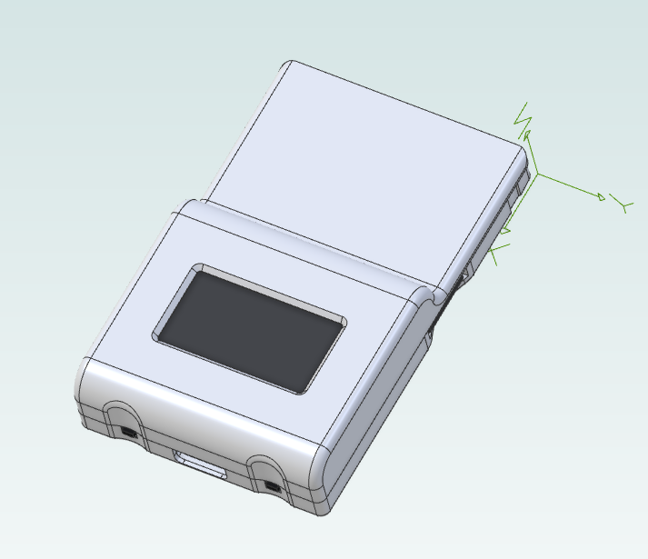
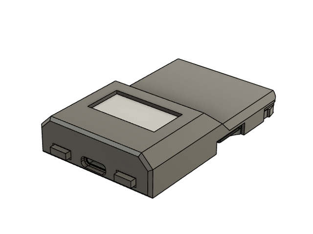

# sd2psx: case

This is the official 3D printable case for the SD2PSX adapter. It is designed to be printed in SLA resin. I recommend ordering it from JLCPCB using the "LEDO 6060 Resin" option; the total price should be about $2.2.

There is an alternative 3D printable case by john3d which is better optimized for FDM printers, and includes bigger button shims for easier accessibility: https://www.printables.com/model/315588-sd2psx-case

